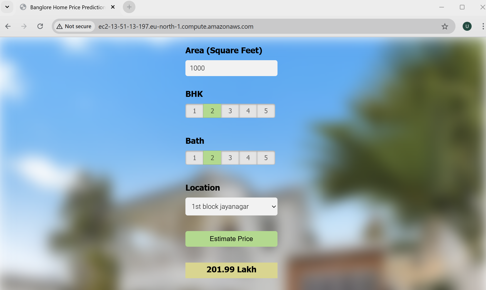

# 🏠 Bangalore Home Price Prediction System

A full-stack Machine Learning  project that predicts real estate prices in Bangalore based on user inputs such as area (sqft), number of bedrooms, and location.

This project demonstrates the complete lifecycle of a machine learning application — from data preprocessing and model building to backend deployment and frontend integration.

---

## 🚀 Project Overview

The system consists of three main components:

- **Machine Learning Model**  
  Built using Linear Regression with Scikit-learn on the Bangalore housing dataset.

- **Backend APIs**  
  Two implementations provided:
  - Flask server
  - FastAPI server  
  Both serve predictions via HTTP endpoints.

- **Frontend Web Application**  
  A simple UI built with HTML, CSS, and JavaScript that interacts with the backend to display predicted prices.

---

## 🧠 Key Concepts Covered

- Data cleaning and preprocessing  
- Outlier detection and removal  
- Feature engineering  
- Dimensionality reduction  
- Hyperparameter tuning using GridSearchCV  
- K-Fold Cross Validation  
- Model serialization and deployment  

---

## 🛠️ Tech Stack

**Languages & Libraries**
- Python  
- NumPy, Pandas  
- Matplotlib  
- Scikit-learn  

**Backend**
- Flask  
- FastAPI  

**Frontend**
- HTML, CSS, JavaScript  

**Tools & Platforms**
- Jupyter Notebook  
- VS Code / PyCharm  
- AWS EC2 (Ubuntu)  
- Nginx (reverse proxy)

---

## 📁 Project Structure

```
BangloreHomePrices/
│
├── client/
│   ├── app.html
│   ├── app.css
│   └── app.js
│
├── model/
│   ├── banglore_home_prices_model.pickle
│   ├── model_file.ipynb
│   └── columns.json
│
├── server/  (Flask)
│   ├── artifacts/
│   │   ├── banglore_home_prices_model.pickle
│   │   └── columns.json
│   ├── server.py
│   └── util.py
│
├── fastapi_server/
│   ├── artifacts/
│   │   ├── banglore_home_prices_model.pickle
│   │   └── columns.json
│   ├── server.py
│   └── util.py
```

---

## ⚙️ How to Run Locally

### 1. Clone the Repository
```bash
git clone https://github.com/your-username/BangloreHomePrices.git
cd BangloreHomePrices
```

### 2. Install Dependencies
```bash
pip install -r requirements.txt
```

### 3. Run Backend Server

**Flask:**
```bash
cd server
python server.py
```

**FastAPI:**
```bash
cd fastapi_server
uvicorn server:app --reload
```

### 4. Run Frontend
Open `client/app.html` in your browser.

---

## 🌐 Deployment

- Deployed on **AWS EC2 (Ubuntu)**  
- Backend services hosted on the instance  
- **Nginx** used as a reverse proxy to route requests  

---

## 📌 Features

- Real-time house price prediction  
- Dual backend support (Flask & FastAPI)  
- End-to-end ML pipeline implementation  
- Cloud deployment ready  

---

## 📈 Future Improvements

- Add more advanced models (e.g., XGBoost, Random Forest)  
- Improve UI/UX  
- Add authentication and user tracking  
- Integrate CI/CD pipeline  
